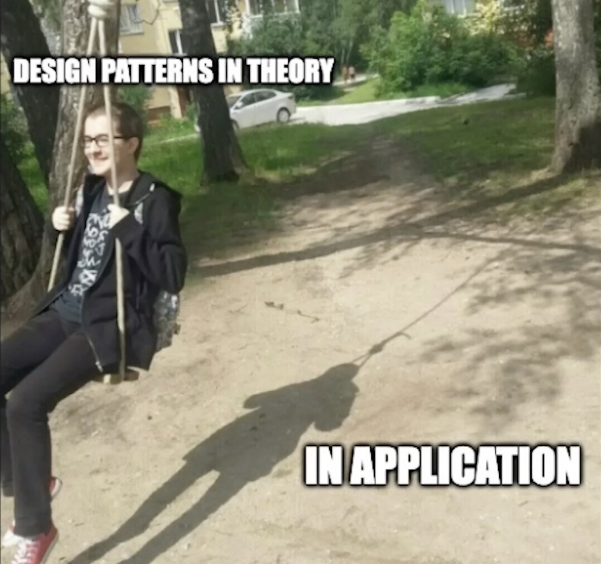
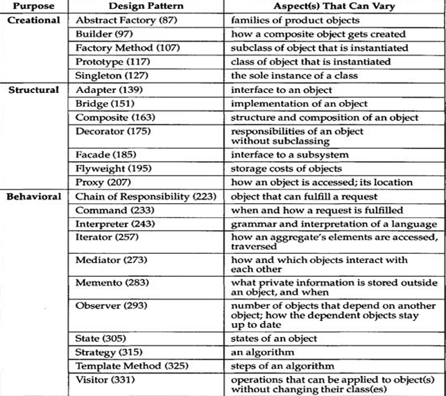
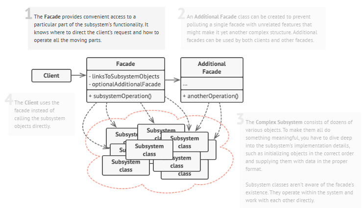
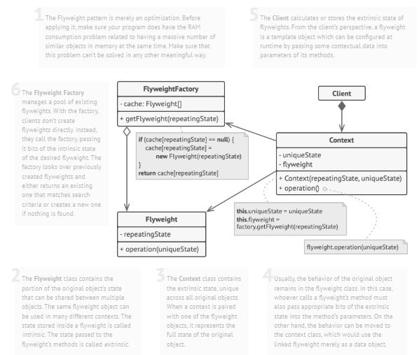
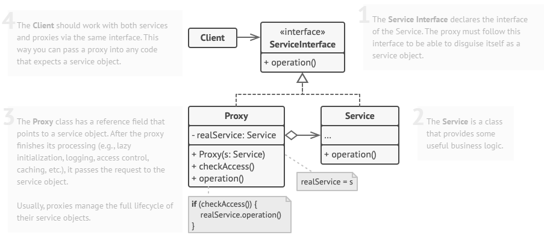
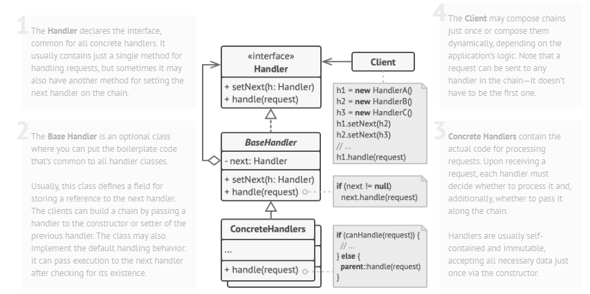
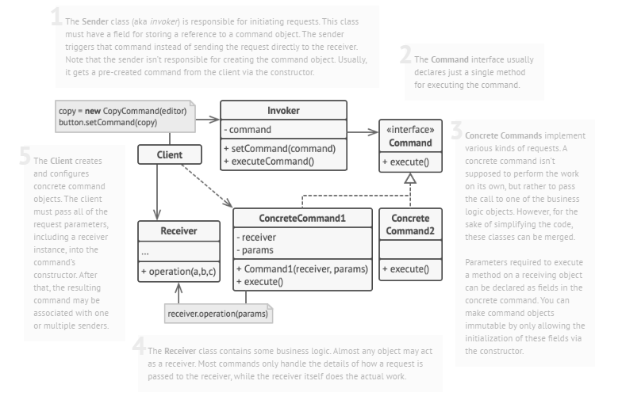
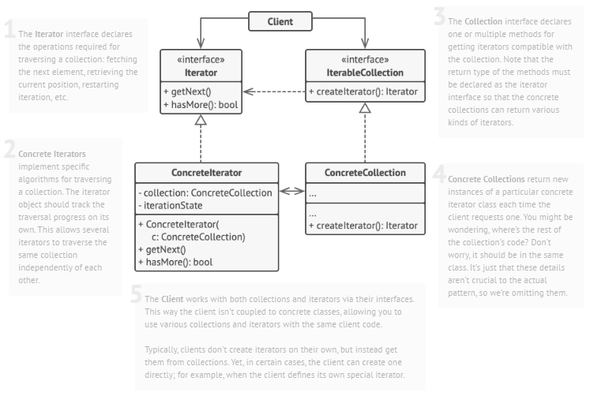
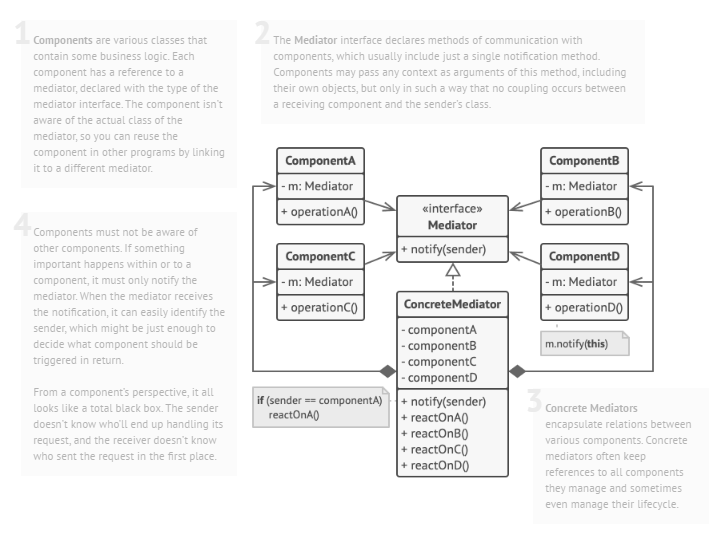

  

<h1 align="center"><b>🔶Design patterns🔶</b></h1>

# Contents

1. [Creational Design Patterns](#-creational-patterns)
    - [Factory Method](#-factory-method)
    - [Abstract Factory](#-abstract-factory)
    - [Builder](#-builder)
    - [Singleton](#-singleton)
    - [Prototype](#-prototype)
2. [Structural Design Patterns](#-structural-patterns)
    - [Adapter](#-adapter)
    - [Bridge](#-bridge)
    - [Prototype](#-prototype)
    - [Decorator](#-decorator)
    - [Facade](#-facade)
    - [Flyweight](#-flyweight)
    - [Proxy](#-proxy)
4. [Solid Principles](#solid-principles)
    - [Single Reponsibility Principle](#-single-responsibility-principle)
    - [Open/Closed Principle](#-openclosed-principle)
    - [Liskov Substitution Principle](#-liskov-substitution-principle)
    - [Interface Segregation Principle](#-interface-segregation-principle)
    - [Dependency Inversion Principle](#-dependency-inversion-principle)
 

---

# 🔶 Design Patterns

**Design patterns** are typical solutions to common problems in software design. Each pattern is like a _blueprint_ that you can customize to solve a particular design problem in your code.

 

## 🔷 Groups of design patterns by purpose

- **Creational patterns** concern the process of object creation.
- **Structural patterns** deal with the composition of classes or objects.
- **Behavioral patterns** characterize the ways in which classes or objects interact and distribute responsibility.

The second criterion is **scope**, specifies whether the pattern applies primarily to classes or objects. 

Class patterns deal with relationships between classes and their subclasses, established through inheritance so they are fixed at compile time.
Object patterns deal with relationships, which can be changed at runtime.

 

---

## 🏗 Creational patterns 

1. **Factory Method**
2. **Abstract Factory**
3. **Builder**
4. **Prototype** 
5. **Singleton** 

 

### 🏭 Factory Method

**Factory method** is a creational design pattern that provides an interface for creating objects in a supperclass, but allows subclasses to alter the type of objects that will be created. The main intent of this pattern is to create objects without exposing the creation logic.

> [!Note]
> The Factory Method pattern suggests that you replace direct object construction calls (using the `new` operator) with calls to a special factory method. Objects returned by a factory method are often referred to as `products`.

The intent of this design pattern is to create objects, but hiding how this objects are created. It is useful when you have a certain logic that is repeated during the creation of that shared type and when you are duplicating the code for that lets create a method for that. So, the factory method is useful when the class has complex initialisation requirements. 

 

### 🗯 Abstract Factory

**Abstract Factory** is a creational design pattern that lets you produce families of related objects without specifying their concrete classes.

> The first thing the Abstract Factory pattern suggests is to explicitly declare interfaces for each distinct product of the product family. The next move is to declare the Abstract Factory—an interface with a list of creation methods for all products that are part of the product family.

Abstract Factory ensures that products created by a factory are consistent with each other (e.g., ModernChair and ModernTable belong to the same "Modern" family). This is particularly useful when the objects are meant to be used together. It does also promotes loose coupling and encapsulates the creation of objects.

Applicability :
- a system should be independent of how its products are created, composed, and represented.
- a system should be configured with one of multiple families of products.
- a family of related product objects is designed to be used together, and you need to enforce this constraint.

 

### 🔶 Singleton 

**Singleton** is a creational design pattern that lets you ensure that a class has only one instance, while providing a global access point to this instance.

❓ How to implement it

    - Make the default constructor private, to prevent other objects from using the `new` operator with the Singleton class.
    - Create a static creation method that acts as a constructor. Under the hood, this method calls the private constructor to create an object and saves it in a static field. All following calls to this method return the cached object.

> [!Note]
> 💡 Use the Singleton pattern when a class in your program should have just a single instance available to all clients.

 

### 🏗 Builder 

**Builder** is a creational design pattern that lets you construct complex objects step by step. The pattern allows you to produce different types and representations of an object using the same construction code.

> [!Note]
> 💡 This pattern is particularly useful when an object has many optional or mandatory parameters and different configurations are required during its creation.

Instead of creating an object directly using its constructor, you use a Builder class. When you’re done configuring the object, you call a  Build() method of the Builder class, which returns the constructed object.

Use cases :
    1. The most common use case for the Builder pattern is when you want to use a mutable object during the initialization phase of an object but want the constructed object to be immutable.
    2. A way to abstract the process of building objects.

### 🤖 Prototype

**Prototype** is a creational design pattern that lets you copy existing objects without making your code dependent on their classes.

The Prototype pattern delegates the cloning process to the actual objects that are being cloned. The pattern declares a common interface for all objects that support cloning. This interface lets you clone an object without coupling your code to the class of that object. Usually, such an interface contains just a single `clone` method.

The implementation of the clone method is very similar in all classes. The method creates an object of the current class and carries over all of the field values of the old object into the new one. You can even copy private fields because most programming languages let objects access private fields of other objects that belong to the same class.

> 💡 Use the Prototype pattern when your code shouldn’t depend on the concrete classes of objects that you need to copy. 
> ⚡ This happens a lot when your code works with objects passed to you from 3rd-party code via some interface. The concrete classes of these objects are unknown, and you couldn’t depend on them even if you wanted to.
> 🔸 The Prototype pattern provides the client code with a general interface for working with all objects that support cloning. This interface makes the client code independent from the concrete classes of objects that it clones.
---

## ⛩ Structural Patterns

 

### 🔌 Adapter

**Adapter** is a structural design pattern that allows objects with incompatible interfaces to work together.

**This is a special object that converts the interface of one object so that another object can understand it.**

Participants :
1. **Target**: The domain specific that the client use
2. **Adapter**: A class that implements the `Target` interface and and adaptss `Adaptee` to it.
3. **Adaptee**: An existing class with an incompatible interface that needs adapting.
4. **Client**: The class that interacts with the `Target` interface.

> [!Note]
> 💡 Use the Adapter class when you want to use some existing class, but its interface isn’t compatible with the rest of your code. The Adapter pattern lets you create a middle-layer class that serves as a translator between your code and a legacy class, a 3rd-party class or any other class with a weird interface.

 

### 〰 Bridge

**Bridge** is a structural design pattern that lets you split a large class or a set of closely related classes into two separate hierarchies—abstraction and implementation—which can be developed independently of each other.

_Abstraction_ (also called _interface_) is a high-level control layer for some entity. This layer isn’t supposed to do any real work on its own. It should delegate the work to the implementation layer. This is not referring to the interfaces and abstract class in programming.

> [!Note]
> Bridge is useful for solving the problem of the cartesian product.

 

### 🧰 Composite

**Composite** is a structural design pattern that lets you compose objects into tree structures and then work with these structures as if they were individual objects.

Key elements :
1. **Component**: An abstract class or interface that defines common methods for both leaf and composite objects.
2. **Leaf**: A class representing individual objects in the hierarchy that do not have any children.
3. **CompositeO**: A class that contains child components (either leaf or composite objects) and implements methods to add, remove, and access its children.    

> [!Note]
> 💡  Use the Composite pattern when you have to implement a tree-like object structure. Use the pattern when you want the client code to treat both simple and complex elements uniformly.

 

### ⛓ Decorator

**Decorator** is a structural design pattern which allows behavior to be added to individual objects, dynamically, without affecting the behavior of other objects from the same class. This pattern is useful when you need to add functionality to objects in a flexible and reusable way.

> [!NOTE]
> The Decorator Pattern is commonly used in scenarios where a variety of optional features or behaviors need to be added to objects in a flexible and reusable manner. It follows the open/closed principle, because new decorators are added without changing the code.

Use the Decorator pattern when: 
- **Extending Functionality**: When you have a base component with basic functionality, but you need to add additional features or behaviors to it dynamically without altering its structure. Decorators allow you to add new responsibilities to objects at runtime.
- **Multiple Combinations of Features**: When you want to provide multiple combinations of features or options to an object. Decorators can be stacked and combined in different ways to create customized variations of objects, providing flexibility to users.
- **Legacy Code Integration**: When working with legacy code or third-party libraries where modifying the existing codebase is not feasible or desirable, decorators can be used to extend the functionality of existing objects without altering their implementation.
- **Input/Output Streams**: Decorators are commonly used in input/output stream classes. They allow you to wrap streams with additional functionality such as buffering, compression, encryption, or logging without modifying the original stream classes.

Key elements: 
1. **Component Interface**: This is an abstract class or interface that defines the common interface for both the concrete components and decorators. It specifies the operations that can be performed on the objects.
2. **Concrete Component**: These are the basic objects or classes that implement the Component interface. They are the objects to which we want to add new behavior or responsibilities.
3. **Decorator**: This is an abstract class that also implements the Component interface and has a reference to a Component object. Decorators are responsible for adding new behaviors to the wrapped Component object.
4. **Concrete Decorator**: These are the concrete classes that extend the Decorator class. They add specific behaviors or responsibilities to the Component. Each Concrete Decorator can add one or more behaviors to the Component.

Related links [Daily-Dev ↗](https://daily.dev/blog/decorator-pattern-explained-basics-to-advanced), [Geeksforgeeks ↗](https://www.geeksforgeeks.org/system-design/decorator-pattern/)

 

### Decorator vs Composite

1. The **decorator** pattern usually decorates one and only one component, and must have to decorate something, while the **Composite** composite one or many components and has add and remove methods.
2. The **decorator** has an another additional class, usually an abstract class for the decorator, while the **composite** it doesn't.
3. The **decorator** is usually used to attach additional behavior to objects, so you have a thing and you wrap it to attach additional behavior, whereas the **composite** we use it if we have something that we want to model as a tree structure.    

 

### 🏛 Facade 

**Facade** is a structural design pattern that provides a simplified interface to a library, a framework, or any other complex set of classes.

> [!Note]
> A facade is a class that provides a simple interface to a complex subsystem which contains lots of moving parts. A facade might provide limited functionality in comparison to working with the subsystem directly. However, it includes only those features that clients really care about. Having a facade is handy when you need to integrate your app with a sophisticated library that has dozens of features, but you just need a tiny bit of its functionality.

 - It is used as a camouflage to cover the complexities of a large system and therefore provides a simple interface to the client. In other words, it is a wrapper class used to hide the implementation details.

> [!Important]
> The goal of facade is to simplify a complicated system. By simplifying the code, we restrict clients from unauthorized access.

Key elements :
1. **Client**: The one that uses your code.
2. **Facade**: Its job is to be able to provide to the client more simplified access towards numerous interdependent subsystems that are considered complicated. 
3. **Subsystems**: The subsystems are hidden from the client

Relevant links: [Medium ↗](https://medium.com/@andreaspoyias/design-patterns-a-quick-guide-to-facade-pattern-16e3d2f1bfb6)

 

### 🔷 Flyweight

**Flyweight** is a structural pattern that optimizes memory usage by sharing a common state among multiple objects. It aims to reduce the number of objects created and to decrease memory footprint, which is particularly useful when dealing with a large number of similar objects.

Instead of creating a new object for each instance, the Flyweight pattern reuses existing ones wherever possible, sharing common parts between objects.

> [!Important]
> **Shared vs. Unique Data**: Objects are split into shared (intrinsic) data and unique (extrinsic) data. The shared data is stored in a central place and reused, while the unique data is kept separately.

How to implement it: 
1. Divide fields of a class that will become a flyweight into two parts:
    - the intrinsic state: the fields that contain unchanging data duplicated across many objects
    - the extrinsic state: the fields that contain contextual data unique to each object
2. Leave the fields that represent the intrinsic state in the > class, but make sure they’re immutable. They should take their initial values only inside the constructor.
3. Go over methods that use fields of the extrinsic state. For each field used in the method, introduce a new parameter and use it instead of the field.
4. Optionally, create a factory class to manage the pool of flyweights. It should check for an existing flyweight before creating a new one. Once the factory is in place, clients must only request flyweights through it. They should describe the desired flyweight by passing its intrinsic state to the factory.
5. The client must store or calculate values of the extrinsic state (context) to be able to call methods of flyweight objects. 

When to use flyweight design pattern:

1. Many similar objects are used and the storage cost is high.
2. The majority of each object’s state data can be made extrinsic.
3. A few shared objects would easily replace many unshared objects.

 

### 🟫 Proxy

**Proxy** is a structural design pattern that lets you provide a substitute or placeholder for another object. A proxy controls access to the original object, allowing you to perform something either before or after the request gets through to the original object.

> [!Note]
> The Proxy pattern suggests that you create a new proxy class with the same interface as an original service object. Then you update your app so that it passes the proxy object to all of the original object’s clients. Upon receiving a request from a client, the proxy creates a real service object and delegates all the work to it.

Most popular use cases :

> 1. **Lazy initialization (virtual proxy)**: Instead of creating the object when the app launches, you can delay the object’s initialization >to a time when it’s really needed.
> 2. **Access control (protection proxy)**: The proxy can pass the request to the service object only if the client’s credentials match some criteria.
> 3. **Local execution of a remote service (remote proxy)**: This is when the service object is located on a remote server. In this case, the proxy passes the client request over the network, handling all of the nasty details of working with the network.
> 4. **Logging requests (logging proxy)**: The proxy can log each request before passing it to the service.
> 5. **Caching request results (caching proxy)**: The proxy can implement caching for recurring requests that always yield the same results.

 

---
## Behavioral Patterns

 

### Chain of Responsibility 

**Chain of Responsibility** is a behavioral design pattern that lets you pass requests along a chain of handlers. Upon receiving a request, each handler decides either to process the request or to pass it to the next handler in the chain.

> [!Note]
> The Chain of Responsibility relies on transforming particular behaviors into stand-alone objects called handlers. The pattern suggests that you link these handlers into a chain. Each linked handler has a field for storing a reference to the next handler in the chain. In addition to processing a request, handlers pass the request further along the chain. The request travels along the chain until all handlers have had a chance to process it, but a handler can decide to not pass the request further down.

Pros : loose coupling, dynamic chain, srp, sequential order

Relevant links : [Geeksforgeeks ↗](https://www.geeksforgeeks.org/system-design/chain-responsibility-design-pattern/), [Medium ↗](https://medium.com/multinetinventiv/the-chain-of-responsibility-pattern-how-to-use-the-pros-and-cons-a799fb97173c)  

 

### 🎮 Command 

Command is a behavioral design pattern that turns a request into a stand-alone object that contains all information about the request. This transformation lets you pass requests as a method arguments, delay or queue a request’s execution, and support undoable operations.

> [!Note]
> - Use the Command pattern when you want to implement reversible operations.
> - Use the Command pattern when you want to parametrize objects with operations.
> - Use the Command pattern when you want to queue operations, schedule their execution, or execute them remotely.

### 🟩 Iterator 

**Iterator** is a behavioral design pattern that lets you traverse elements of a collection without exposing its underlying representation (list, stack, tree, etc.).

> [!Note]
> Use the Iterator pattern when your collection has a complex data structure under the hood, but you want to hide its complexity from clients (either for convenience or security reasons)
> Use the pattern to reduce duplication of the traversal code across your app.
> Use the Iterator when you want your code to be able to traverse different data structures or when types of these structures are unknown beforehand.

 

### 🎡 Mediator

**Mediator** is a behavioral design pattern that lets you reduce chaotic dependencies between objects. The pattern restricts direct communications between the objects and forces them to collaborate only via a mediator object.

> [!Note]
> The Mediator pattern suggests that you should cease all direct communication between the components which you want to make independent of each other. Instead, these components must collaborate indirectly, by calling a special mediator object that redirects the calls to appropriate components. As a result, the components depend only on a single mediator class instead of being coupled to dozens of their colleagues.

> - Use the Mediator pattern when it’s hard to change some of the classes because they are tightly coupled to a bunch of other classes.
> - Use the pattern when you can’t reuse a component in a different program because it’s too dependent on other components.
> -  Use the Mediator when you find yourself creating tons of component subclasses just to reuse some basic behavior in various contexts.

Related links : [daily.dev ↗](https://daily.dev/blog/mediator-design-pattern-explained)

##  Solid Principles

**_SOLID_** is a mnemonic for five design principles intended to make software designs more **understandable**, **flexible** and **maintainable**.

### 🔴 Single Responsibility Principle

**A class should have just one reason to change.**

> Try to make the class responsible for a part of the functionality provided by the software. if a class does too many things, you have to change it every time one of these things changes. While doing that, you’re risking breaking other parts of the class which you didn’t even intend to change. It suggests that you should a separate class foreach functionality.

### 🟠 Open/Closed Principle

**Classes should be open for extensions but closed not for modifications.**

The main idea of this principle is to keep existing code from breaking when you implement new features. So adding code with changing the existing code.

A class is open if you can extend it, produce a subclass. Also a class is closed when its interface is clearly defined and won't change in the future.

> For example, if a class is already developed, tested, reviewed and included in some framework, or used in the app, trying to mess with its code is risky. Instead of changing directly you can create a subclass and override the parts of the base class that you want to behave differently. 

### 🟡 Liskov Substitution Principle

**When extending a class, you should be able to pass objects of the subclass in place of objects of the parent class without breaking the client code.**

> The substitution principle is a set of checks that help predict whether a subclass remains compatible with the code that was able to work with objects of the super class. 

### 🟢 Interface Segregation Principle

**Clients shouldn’t be forced to depend on methods they do not use.**

> You shouldn't create "fat" interfaces, but more specific ones. Clients should implement only those methods that they really need. 

### 🔵 Dependency Inversion Principle

**High-level classes shouldn't depend on low-level classes. Both should depend on abstractions. Abstractions should not depend on details. Details should depend on abstractions.**

- **Low-level classes** implement basic operations, such as connecting to database, reading a file.
- **High-level classes** contain complex business logic that direcrs low-level classes to do something.

Usually you solve this using interfaces and implementing dependency injection.
    

