# 🔶 Design Patterns

**Design patterns** are typical solutions to common problems in software design. Each pattern is like a _blueprint_ that you can customize to solve a particular design problem in your code.

## 🔷 Groups of design patterns by purpose

- **Creational patterns** concern the process of object creation.
- **Structural patterns** deal with the composition of classes or objects.
- **Behavioral patterns** characterize the ways in which classes or objects interact and distribute responsibility.

The second criterion is **scope**, specifies whether the pattern applies primarily to classes or objects. 
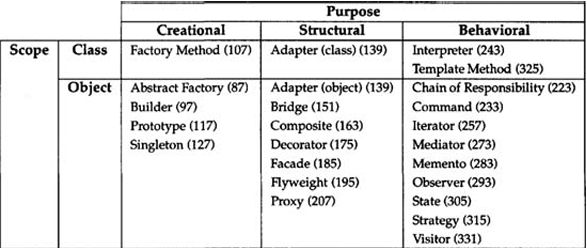

Class patterns deal with relationships between classes and their subclasses, established through inheritance so they are fixed at compile time.
Object patterns deal with relationships, which can be changed at runtime.

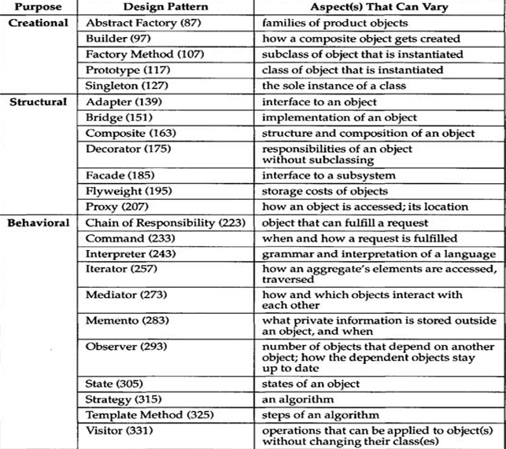

## 🏗 Creational patterns 

1. **Factory Method**
2. **Abstract Factory**
3. **Builder**
4. **Prototype** 
5. **Singleton**

### 🏭 Factory Method

**Factory method** is a creational design pattern that provides an interface for creating objects in a supperclass, but allows subclasses to alter the type of objects that will be created. The main intent of this pattern is to create objects without exposing the creation logic.

> The Factory Method pattern suggests that you replace direct object construction calls (using the `new` operator) with calls to a special factory method. Objects returned by a factory method are often referred to as `products`.

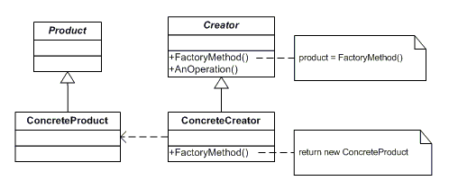

The intent of this design pattern is to create objects, but hiding how this objects are created. It is useful when you have a certain logic that is repeated during the creation of that shared type and when you are duplicating the code for that lets create a method for that. So, the factory method is useful when the class has complex initialisation requirements. 

### 🗯 Abstract Factory

**Abstract Factory** is a creational design pattern that lets you produce families of related objects without specifying their concrete classes.

> The first thing the Abstract Factory pattern suggests is to explicitly declare interfaces for each distinct product of the product family. The next move is to declare the Abstract Factory—an interface with a list of creation methods for all products that are part of the product family.

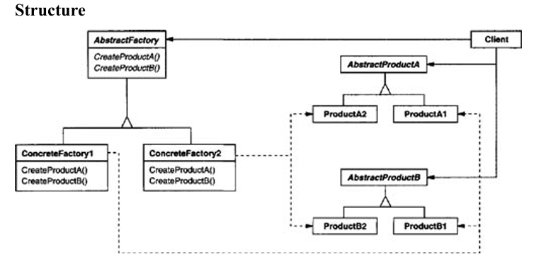

Abstract Factory ensures that products created by a factory are consistent with each other (e.g., ModernChair and ModernTable belong to the same "Modern" family). This is particularly useful when the objects are meant to be used together. It does also promotes loose coupling and encapsulates the creation of objects.

Applicability :
- a system should be independent of how its products are created, composed, and represented.
- a system should be configured with one of multiple families of products.
- a family of related product objects is designed to be used together, and you need to enforce this constraint.

### 🔶 Singleton 

**Singleton** is a creational design pattern that lets you ensure that a class has only one instance, while providing a global access point to this instance.

❓ How to implement it

- Make the default constructor private, to prevent other objects from using the `new` operator with the Singleton class.
- Create a static creation method that acts as a constructor. Under the hood, this method calls the private constructor to create an object and saves it in a static field. All following calls to this method return the cached object.

> 💡 Use the Singleton pattern when a class in your program should have just a single instance available to all clients.

### 🏗 Builder 

**Builder** is a creational design pattern that lets you construct complex objects step by step. The pattern allows you to produce different types and representations of an object using the same construction code.

> 💡 This pattern is particularly useful when an object has many optional or mandatory parameters and different configurations are required during its creation.

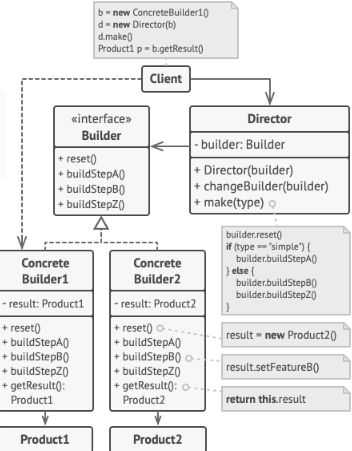

Instead of creating an object directly using its constructor, you use a Builder class. When you’re done configuring the object, you call a  Build() method of the Builder class, which returns the constructed object.

Use cases :
1. The most common use case for the Builder pattern is when you want to use a mutable object during the initialization phase of an object but want the constructed object to be immutable.
2. A way to abstract the process of building objects.

### 🤖 Prototype

**Prototype** is a creational design pattern that lets you copy existing objects without making your code dependent on their classes.

The Prototype pattern delegates the cloning process to the actual objects that are being cloned. The pattern declares a common interface for all objects that support cloning. This interface lets you clone an object without coupling your code to the class of that object. Usually, such an interface contains just a single `clone` method.

The implementation of the clone method is very similar in all classes. The method creates an object of the current class and carries over all of the field values of the old object into the new one. You can even copy private fields because most programming languages let objects access private fields of other objects that belong to the same class.
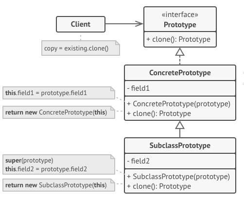

> 💡 Use the Prototype pattern when your code shouldn’t depend on the concrete classes of objects that you need to copy. 
> ⚡ This happens a lot when your code works with objects passed to you from 3rd-party code via some interface. The concrete classes of these objects are unknown, and you couldn’t depend on them even if you wanted to.
> 🔸 The Prototype pattern provides the client code with a general interface for working with all objects that support cloning. This interface makes the client code independent from the concrete classes of objects that it clones.
---

## Structural Design Patterns

### 🔌 Adapter

**Adapter** is a structural design pattern that allows objects with incompatible interfaces to work together.

**This is a special object that converts the interface of one object so that another object can understand it.**

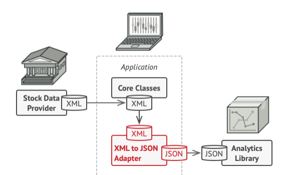
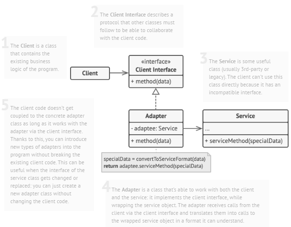

Participants :
1. **Target**: The domain specific that the client use
2. **Adapter**: A class that implements the `Target` interface and and adaptss `Adaptee` to it.
3. **Adaptee**: An existing class with an incompatible interface that needs adapting.
4. **Client**: The class that interacts with the `Target` interface.

> 💡 Use the Adapter class when you want to use some existing class, but its interface isn’t compatible with the rest of your code. The Adapter pattern lets you create a middle-layer class that serves as a translator between your code and a legacy class, a 3rd-party class or any other class with a weird interface.

### 〰 Bridge

**Bridge** is a structural design pattern that lets you split a large class or a set of closely related classes into two separate hierarchies—abstraction and implementation—which can be developed independently of each other.

_Abstraction_ (also called _interface_) is a high-level control layer for some entity. This layer isn’t supposed to do any real work on its own. It should delegate the work to the implementation layer. This is not referring to the interfaces and abstract class in programming.

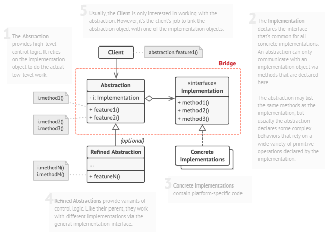

Bridge is useful for solving the problem of the cartesian product.

### 🧰 Composite

**Composite** is a structural design pattern that lets you compose objects into tree structures and then work with these structures as if they were individual objects.

Key elements :
1. **Component**: An abstract class or interface that defines common methods for both leaf and composite objects.
2. **Leaf**: A class representing individual objects in the hierarchy that do not have any children.
3. **CompositeO**: A class that contains child components (either leaf or composite objects) and implements methods to add, remove, and access its children.    

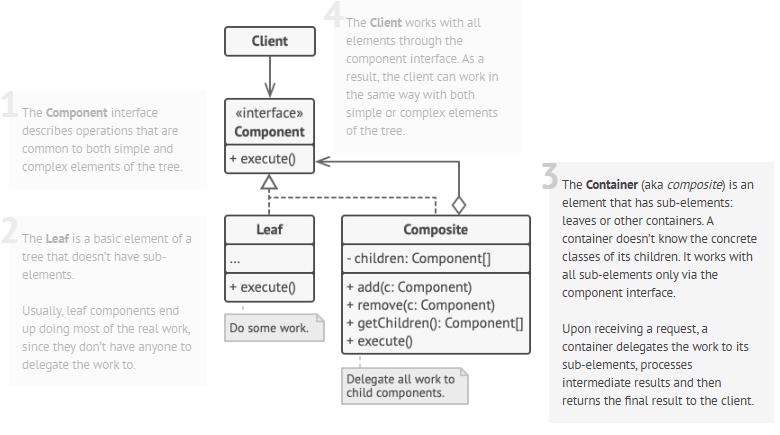

> 💡  Use the Composite pattern when you have to implement a tree-like object structure. Use the pattern when you want the client code to treat both simple and complex elements uniformly.

### 🔶 Decorator

**Decorator** is a structural design pattern which allows behavior to be added to individual objects, dynamically, without affecting the behavior of other objects from the same class. This pattern is useful when you need to add functionality to objects in a flexible and reusable way.

> [!NOTE]
> The Decorator Pattern is commonly used in scenarios where a variety of optional features or behaviors need to be added to objects in a flexible and reusable manner. It follows the open/closed principle, because new decorators are added without changing the code.

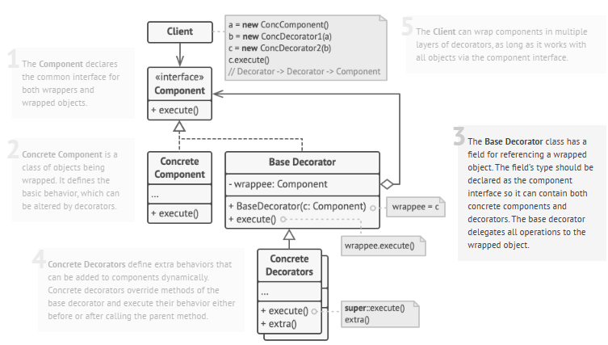

Use the Decorator pattern when: 
- **Extending Functionality**: When you have a base component with basic functionality, but you need to add additional features or behaviors to it dynamically without altering its structure. Decorators allow you to add new responsibilities to objects at runtime.
- **Multiple Combinations of Features**: When you want to provide multiple combinations of features or options to an object. Decorators can be stacked and combined in different ways to create customized variations of objects, providing flexibility to users.
- **Legacy Code Integration**: When working with legacy code or third-party libraries where modifying the existing codebase is not feasible or desirable, decorators can be used to extend the functionality of existing objects without altering their implementation.
- **Input/Output Streams**: Decorators are commonly used in input/output stream classes. They allow you to wrap streams with additional functionality such as buffering, compression, encryption, or logging without modifying the original stream classes.

Key elements: 
1. **Component Interface**: This is an abstract class or interface that defines the common interface for both the concrete components and decorators. It specifies the operations that can be performed on the objects.
2. **Concrete Component**: These are the basic objects or classes that implement the Component interface. They are the objects to which we want to add new behavior or responsibilities.
3. **Decorator**: This is an abstract class that also implements the Component interface and has a reference to a Component object. Decorators are responsible for adding new behaviors to the wrapped Component object.
4. **Concrete Decorator**: These are the concrete classes that extend the Decorator class. They add specific behaviors or responsibilities to the Component. Each Concrete Decorator can add one or more behaviors to the Component.

Related links [daily.dev](https://daily.dev/blog/decorator-pattern-explained-basics-to-advanced) 
 
##  Solid Principles

**_SOLID_** is a mnemonic for five design principles intended to make software designs more **understandable**, **flexible** and **maintainable**.

### 🔴 Single Responsibility Principle

**A class should have just one reason to change.**

> Try to make the class responsible for a part of the functionality provided by the software. if a class does too many things, you have to change it every time one of these things changes. While doing that, you’re risking breaking other parts of the class which you didn’t even intend to change. It suggests that you should a separate class foreach functionality.

### 🟠 Open/Closed Principle

**Classes should be open for extensions but closed not for modifications.**

The main idea of this principle is to keep existing code from breaking when you implement new features. So adding code with changing the existing code.

A class is open if you can extend it, produce a subclass. Also a class is closed when its interface is clearly defined and won't change in the future.

> For example, if a class is already developed, tested, reviewed and included in some framework, or used in the app, trying to mess with its code is risky. Instead of changing directly you can create a subclass and override the parts of the base class that you want to behave differently. 

### 🟡 Liskov Substitution Principle

**When extending a class, you should be able to pass objects of the subclass in place of objects of the parent class without breaking the client code.**

> The substitution principle is a set of checks that help predict whether a subclass remains compatible with the code that was able to work with objects of the super class. 

### 🟢 Interface Segregation Principle

**Clients shouldn’t be forced to depend on methods they do not use.**

> You shouldn't create "fat" interfaces, but more specific ones. Clients should implement only those methods that they really need. 

### 🔵 Dependency Inversion Principle

**High-level classes shouldn't depend on low-level classes. Both should depend on abstractions. Abstractions should not depend on details. Details should depend on abstractions.**

- **Low-level classes** implement basic operations, such as connecting to database, reading a file.
- **High-level classes** contain complex business logic that direcrs low-level classes to do something.

Usually you solve this using interfaces and implementing dependency injection.
    

