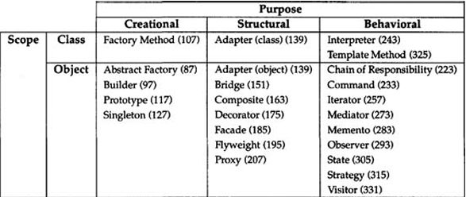

# 🔶 Design Patterns

**Design patterns** are typical solutions to common problems in software design. Each pattern is like a _blueprint_ that you can customize to solve a particular design problem in your code.

## 🔷 Groups of design patterns by purpose

- **Creational patterns** concern the process of object creation.
- **Structural patterns** deal with the composition of classes or objects.
- **Behavioral patterns** characterize the ways in which classes or objects interact and distribute responsibility.

The second criterion is **scope**, specifies whether the pattern applies primarily to classes or objects. 

Class patterns deal with relationships between classes and their subclasses, established through inheritance so they are fixed at compile time.
Object patterns deal with relationships, which can be changed at runtime.

## 🏗 Creational patterns 

1. **Factory Method**
2. **Abstract Factory**
3. **Builder**
4. **Prototype** 
5. **Singleton**

### 🏭 Factory Method

##  Solid Principles

**_SOLID_** is a mnemonic for five design principles intended to make software designs more **understandable**, **flexible** and **maintainable**.

### 🔴 Single Responsibility Principle

**A class should have just one reason to change.**

> Try to make the class responsible for a part of the functionality provided by the software. if a class does too many things, you have to change it every time one of these things changes. While doing that, you’re risking breaking other parts of the class which you didn’t even intend to change. It suggests that you should a separate class foreach functionality.

### 🟠 Open/Closed Principle

**Classes should be open for extensions but closed not for modifications.**

The main idea of this principle is to keep existing code from breaking when you implement new features.

A class is open if you can extend it, produce a subclass. Also a class is closed when its interface is clearly defined and won't change in the future.

> For example, if a class is already developed, tested, reviewed and included in some framework, or used in the app, trying to mess with its code is risky. Instead of changing directly you can create a subclass and override the parts of the base class that you want to behave differently. 

### 🟡 Liskov Substitution Principle

**When extending a class, you should be able to pass objects of the subclass in place of objects of the parent class without breaking the client code.**

> The substitution principle is a set of checks that help predict whether a subclass remains compatible with the code that was able to work with objects of the super class. 

### 🟢 Interface Segregation Principle

**Clients shouldn’t be forced to depend on methods they do not use.**

> You shouldn't create "fat" interfaces, but more specific ones. Clients should implement only those methods that they really need. 

### 🔵 Dependency Inversion Principle

**High-level classes shouldn't depend on low-level classes. Both should depend on abstractions. Abstractions should not depend on details. Details should depend on abstractions.**

- **Low-level classes** implement basic operations, such as connecting to database, reading a file.
- **High-level classes** contain complex business logic that direcrs low-level classes to do something.

Usually you solve this using interfaces and implementing dependency injection.
    

